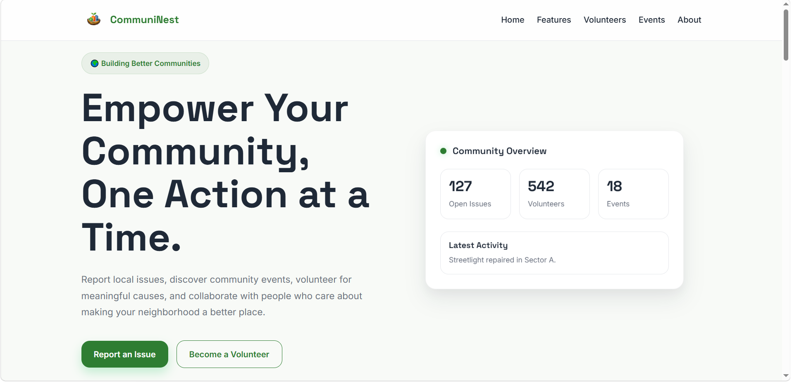
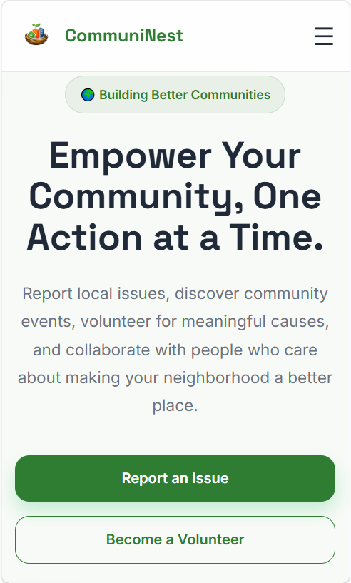
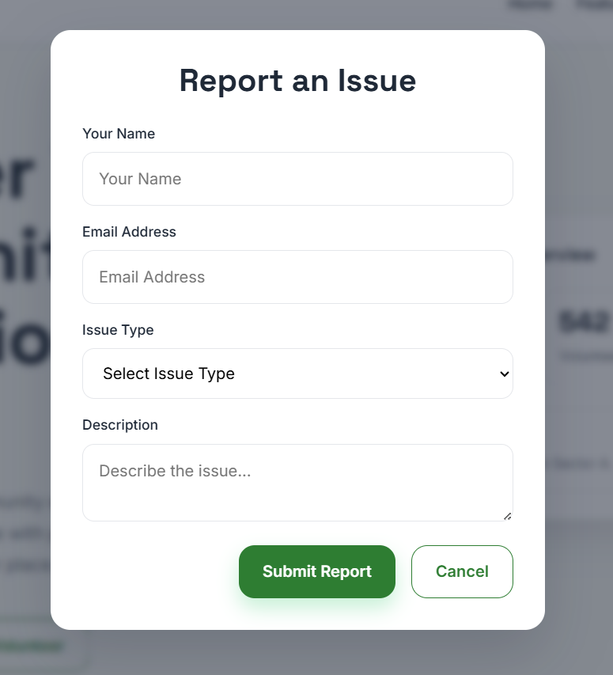
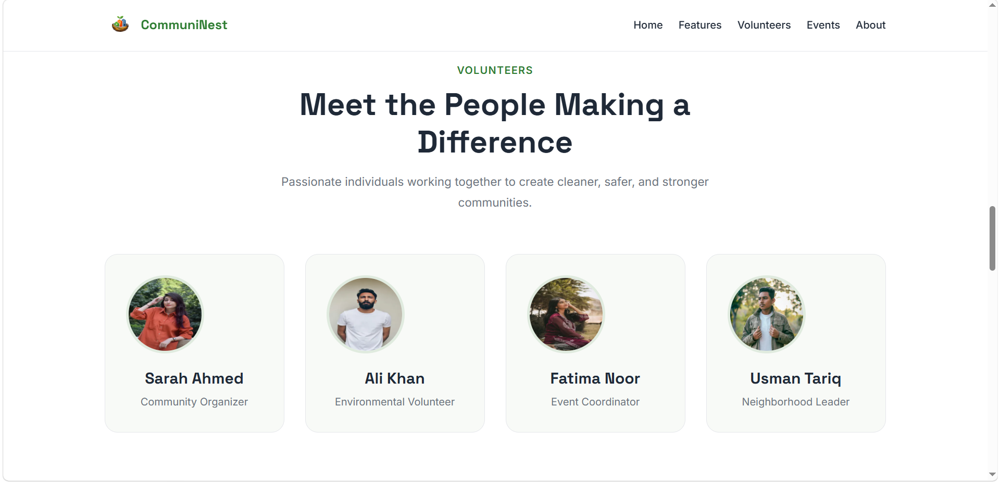
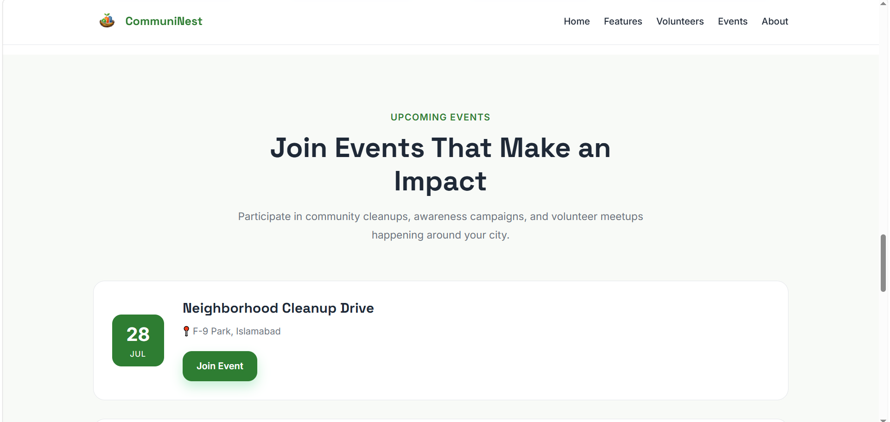

# 🌍 CommuniNest

> **Building Better Communities Together**

CommuniNest is a modern, responsive community platform landing page designed to encourage citizens to report local issues, discover community events, and connect with volunteers working together to improve their neighborhoods.

Built as a frontend portfolio project, CommuniNest demonstrates modern HTML, CSS, and JavaScript development practices with a strong focus on responsive design, reusable CSS architecture, accessibility, and clean user experience.

---

## 🚀 Live Demo

🔗 **Netlify:** *(Add after deployment)*

---

# 📸 Preview

*(Screenshots will be added after deployment.)*

---

# ✨ Features

- 🌍 Modern community-focused landing page
- 📍 Report Issue modal built using the native HTML `<dialog>` element
- 🍞 Toast notification after successful form submission
- 👥 Volunteer showcase section
- 📅 Community events section
- 📊 Community statistics dashboard
- 💬 Testimonials section
- 📱 Fully responsive across desktop, tablet, and mobile devices
- 🎨 Modular CSS architecture
- ♿ Accessibility improvements using semantic HTML and ARIA attributes
- ⚡ Smooth animations and hover interactions

---

# 🛠 Tech Stack

| Technology | Purpose |
|------------|----------|
| HTML5 | Structure |
| CSS3 | Styling |
| JavaScript (ES6) | Interactivity |
| CSS Variables | Design Tokens |
| Flexbox | Layout |
| CSS Grid | Responsive Sections |
| Git | Version Control |
| GitHub | Source Code Hosting |

---

# 📂 Folder Structure

```text
CommuniNest/
│
├── assets/
│   ├── images/
│   ├── logo/
│   └── screenshots/
│
├── css/
│   ├── base/
│   ├── components/
│   ├── layouts/
│   └── pages/
│
├── js/
│   └── main.js
│
├── index.html
├── README.md
└── .gitignore
```

---

# 🚀 Getting Started

### Clone the repository

```bash
git clone https://github.com/abdullahcodes-dev/CommuniNest.git
```

### Navigate into the project

```bash
cd CommuniNest
```

### Run the project

Simply open

```text
index.html
```

or use **VS Code Live Server** for the best development experience.

---

# 🎯 Project Highlights

## 📱 Responsive Design

CommuniNest adapts seamlessly across desktop, tablet, and mobile devices using CSS Grid, Flexbox, and responsive breakpoints.

---

## 🎨 Modular CSS Architecture

The project follows a scalable CSS structure organized into:

- Base
- Layouts
- Components
- Pages

This separation keeps styles maintainable and easy to extend.

---

## 🪟 Native HTML Dialog

Instead of building a custom modal from scratch, the project uses the native HTML `<dialog>` element to provide a cleaner implementation and improved accessibility.

---

## ✨ Modern UI

The interface uses:

- CSS Variables
- Consistent spacing scale
- Reusable shadows
- Rounded corners
- Smooth transitions
- Responsive layouts

to create a polished and modern user experience.

---

# 📷 Screenshots

## 🖥 Desktop View



---

## 📱 Mobile View



---

## 📍 Report Issue Modal



---

## 👥 Volunteers Section



---

## 📅 Events Section



---

# ♿ Accessibility

CommuniNest includes several accessibility improvements:

- Semantic HTML
- Proper heading hierarchy
- Keyboard-accessible modal
- Focus-visible styles
- Form labels
- ARIA attributes
- Responsive typography

---

# 📈 Future Improvements

Some ideas for future versions include:

- Backend integration
- User authentication
- Volunteer registration
- Event registration
- Issue tracking dashboard
- Interactive maps
- Dark mode
- Admin dashboard
- Search and filtering
- Progressive Web App (PWA)

---

# 🧠 What I Learned

While building CommuniNest, I strengthened my understanding of:

- Responsive Web Design
- CSS Architecture
- Design Tokens
- Flexbox & CSS Grid
- Native HTML Dialog API
- DOM Manipulation
- Event Handling
- Modular CSS Organization
- Git & GitHub Workflow
- UI/UX Design Principles
- Accessibility Best Practices

---

# 👨‍💻 Author

**Muhammad Abdullah**

BS Computer Science Student

Frontend Developer

GitHub:
https://github.com/abdullahcodes-dev

---

# ⭐ Support

If you enjoyed this project or found it helpful, consider giving it a ⭐ on GitHub.

It motivates me to continue building and sharing more projects!
